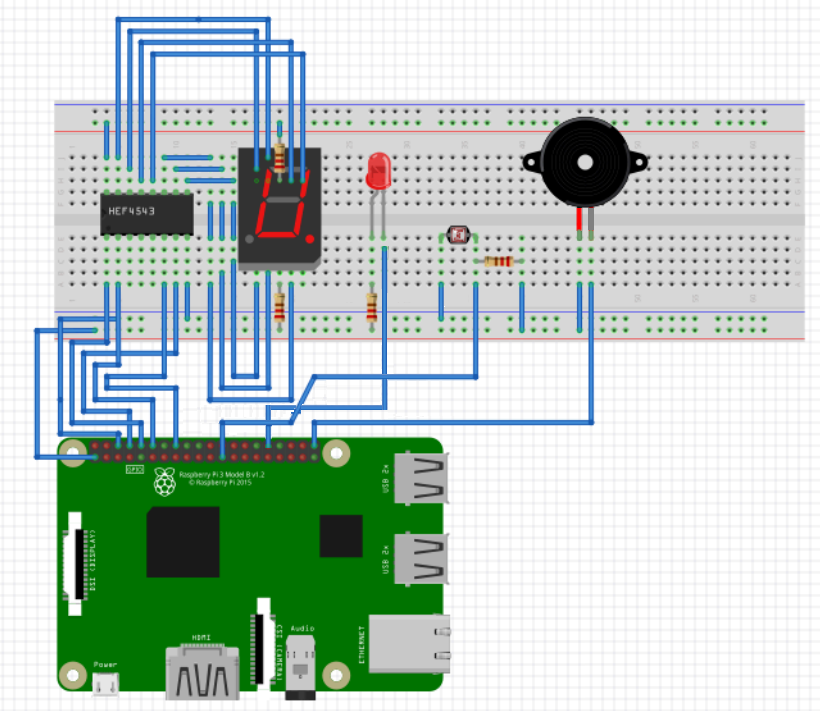

# TCP 원격 장치 제어 프로그램

라즈베리파이 기반 임베디드 IoT 디바이스 원격 제어 시스템입니다. TCP/IP 소켓 통신을 통해 클라이언트에서 서버로 명령을 전송하고, 멀티스레딩 기반으로 다양한 센서 및 장치를 제어합니다.

## 📋 목차

- [주요 기능](#주요-기능)
- [기술 스택](#기술-스택)
- [시스템 아키텍처](#시스템-아키텍처)
- [구현 기술](#구현-기술)
- [설치 및 실행](#설치-및-실행)
- [사용 방법](#사용-방법)
- [프로젝트 구조](#프로젝트-구조)

## 🎯 주요 기능

### 디바이스 제어
- **LED 제어**: ON/OFF 및 PWM 기반 밝기 조절 (0~100 단계)
- **부저 제어**: 멜로디 재생 및 단발음 출력
- **조도 센서**: 자동 LED 제어 시스템
- **FND 세그먼트**: 카운트다운 타이머 (9→0)
- **카메라 캡처**: 주기적 이미지 저장 및 원격 다운로드

### 네트워크 기능
- **멀티 클라이언트 지원**: 최대 10개 동시 연결
- **파일 전송**: 캡처 이미지 다운로드 및 진행률 표시
- **실시간 명령 처리**: 비동기 명령 큐 기반 제어

<!-- 디바이스 제어 화면 스크린샷 삽입 위치 -->

## 🛠 기술 스택

### 언어 및 라이브러리
- **C Language**: 시스템 프로그래밍
- **WiringPi**: GPIO 제어 라이브러리
- **POSIX Threads (pthread)**: 멀티스레딩
- **Berkeley Sockets**: TCP/IP 네트워크 통신
- **libcamera**: 라즈베리파이 카메라 인터페이스

### 하드웨어
- Raspberry Pi (BCM GPIO 핀맵)
- LED, 부저, 조도센서(CDS), FND 세그먼트, 카메라 모듈


| 장치     | 세부 | BCM 번호 |
| ------ | -- | ------ |
| 7447   | A  | 14     |
| 7447   | B  | 15     |
| 7447   | C  | 18     |
| 7447   | D  | 23     |
| LED    | –  | 24     |
| CDS    | –  | 11     |
| BUZZER | –  | 21     |


## 🏗 시스템 아키텍처

```
┌─────────────┐         TCP/IP          ┌─────────────┐
│   Client    │ ◄─────────────────────► │   Server    │
│  (client.c) │   Socket (Port 5000)    │  (main.c)   │
└─────────────┘                         └──────┬──────┘
                                               │
                                   ┌───────────┼───────────┐
                                   │           │           │
                             ┌──────▼─────┐ ┌──▼────────┐  │
                             │  Client    │ │  Device   │  │
                             │  Handler   │ │  Worker   │  │
                             │  (Thread)  │ │  (Thread) │  │
                             └──────┬─────┘ └──┬────────┘  │
                                    │          │           │
                                    │    ┌─────▼─────┐     │
                                    │    │  Command  │     │
                                    └───►│   Queue   │     │
                                         │ (Mutex +  │     │
                                         │  CondVar) │     │
                                         └───────────┘     │
                                                           │
                                         ┌─────────────────▼─┐
                                         │  Hardware Layer   │
                                         │  LED/Buzzer/CDS/  │
                                         │  FND/Camera       │
                                         └───────────────────┘
```

## 💡 구현 기술

### 1. Producer-Consumer 패턴 기반 명령 큐
```c
// command_queue.c
- pthread_mutex_t: 큐 동기화
- pthread_cond_t: 조건 변수를 통한 효율적 대기
- 링크드 리스트 구조의 FIFO 큐
```

**기술적 특징**:
- **Race Condition 방지**: Mutex를 통한 임계 영역 보호
- **효율적 대기**: Condition Variable로 바쁜 대기(busy waiting) 방지
- **디커플링**: 네트워크 I/O와 디바이스 제어 로직 분리

### 2. 멀티스레드 아키텍처
- **Client Handler Thread**: 각 클라이언트 연결마다 독립적인 스레드 생성
- **Device Worker Thread**: 단일 워커 스레드가 모든 디바이스 제어 처리
- **Sensor Threads**: 각 센서별 독립적인 제어 스레드 (부저, 조도센서, FND, 카메라)

```c
// 스레드 안전성 보장
static volatile int sensor_running = 0;  // 상태 플래그
static volatile int sensor_stop_flag = 0; // 종료 신호
pthread_join(): 스레드 종료 대기
```

### 3. TCP 소켓 프로토콜 설계
```
[명령 프로토콜]
LED_ON\n
BRIGHTNESS <level>\n
BUZZER_ON\n
SEGMENT_START\n

[응답]
OK\n

[파일 전송 프로토콜]
1. LIST_BEGIN\n
2. <index> <filename> <size>\n (반복)
3. LIST_END\n
4. GET <index>\n
5. FILE_BEGIN <filename> <size>\n
6. <binary data>
7. FILE_END\n
```

**구현 기법**:
- **Line-based Protocol**: `recv_line()` 함수로 `\n` 기반 메시지 파싱
- **Binary Safe Transfer**: 파일 크기 명시 후 정확한 바이트 수신
- **Progress Tracking**: 실시간 다운로드 진행률 계산

### 4. PWM을 통한 LED 밝기 제어
```c
softPwmCreate(LED, 0, 100);  // 0~100 범위 PWM
softPwmWrite(LED, 100 - level); // Active-low 제어
```

**기술 원리**:
- **Software PWM**: WiringPi의 소프트웨어 기반 PWM 구현
- **Duty Cycle 제어**: 0~100% 듀티 사이클로 LED 밝기 조절
- **Active-low 로직**: GPIO LOW일 때 LED ON

### 5. 비동기 카메라 캡처 시스템
```c
// camera.c
- 60초 주기로 자동 캡처
- 타임스탬프 기반 파일명: YYYYMMDD_HHMMSS.jpg
- libcamera-still 명령어 활용
```

### 6. 파일 시스템 기반 데이터 관리
```c
// file_transfer.c
- dirent.h: 디렉토리 탐색
- stat(): 파일 메타데이터 조회
- ./data/ 디렉토리에 캡처 이미지 저장
```

### 7. 음악 재생 알고리즘
```c
// buzzer.c
- 음계 배열 (C5~Bb5, REST)
- 박자 배열 (E:220ms, Q:440ms, H:660ms)
- softTone API를 통한 주파수 생성
- 스레드 기반 비동기 재생
```

<!-- 실행 화면 GIF 삽입 위치 -->

## 📦 설치 및 실행

### 사전 요구사항
```bash
# WiringPi 설치 (Raspberry Pi)
sudo apt-get update
sudo apt-get install wiringpi

# libcamera 설치
sudo apt-get install libcamera-apps
```

### 컴파일
```bash
# 서버 컴파일
gcc -o server main.c server_socket.c client_handler.c \
    command_queue.c device_worker.c file_transfer.c \
    sensors/*.c -lwiringPi -lpthread

# 클라이언트 컴파일
gcc -o client client.c
```

### 실행
```bash
# 서버 실행 (Raspberry Pi)
./server

# 클라이언트 실행 (어디서든)
./client <RASPBERRY_PI_IP>
```
## 📦 설치 및 실행

### 컴파일

```bash
# 클라이언트 및 서버 컴파일
/tcp_remote_controller $ cmake -S . -B build
/tcp_remote_controller $ cmake --build build
```

### 실행

```bash
# 서버 실행 (Raspberry Pi)
/tcp_remote_controller/exec/server $ ./server

# 클라이언트 실행
/tcp_remote_controller/exec/client $ ./client <RASPBERRY_PI_IP>
```

### 서버 종료

```bash
cat /var/run/tcp_server.pid
kill $(cat /var/run/iot_server.pid)
```


## Build System

- CMake 기반 빌드 시스템 구성
- 센서 제어 모듈을 공유 라이브러리(.so)로 분리 / 동적 라이브러리 구현
- client / server 실행 파일 분리 빌드
- rpath 설정을 통해 별도 환경 변수 없이 실행 가능

## 📖 사용 방법

### 클라이언트 메뉴
```
[ Device Control Menu ]
1. LED ON
2. LED OFF
3. Set Brightness       # 0~100 입력
4. BUZZER ON           # 멜로디 재생
5. BUZZER OFF
6. SENSOR ON           # 조도 센서 자동 제어 시작
7. SENSOR OFF
8. SEGMENT START       # 9초 카운트다운
9. SEGMENT STOP
10. CAPTURE DOWNLOAD   # 이미지 다운로드
0. Exit
```

### 캡처 다운로드 절차
1. 메뉴에서 `10` 선택
2. 서버에 저장된 이미지 목록 확인
3. 다운로드할 이미지 인덱스 입력
4. 진행률과 함께 파일 수신

<!-- 클라이언트 실행 화면 스크린샷 삽입 위치 -->

## 📂 프로젝트 구조

```
.
├── main.c                  # 서버 메인 (초기화 및 시작)
├── server_socket.c/h       # TCP 서버 소켓 생성 및 관리
├── client_handler.c/h      # 클라이언트 연결 처리 스레드
├── command_queue.c/h       # 명령 큐 (Producer-Consumer)
├── device_worker.c/h       # 디바이스 제어 워커 스레드
├── file_transfer.c/h       # 파일 전송 프로토콜 구현
├── client.c                # 클라이언트 프로그램
├── sensors/
│   ├── sensors.h           # 센서 API 헤더
│   ├── led.c               # LED + PWM 제어
│   ├── buzzer.c            # 부저 + 음악 재생
│   ├── cds.c               # 조도 센서
│   ├── fnd.c               # 7-segment 디스플레이
│   └── camera.c            # 카메라 캡처
```

## 🔧 핵심 헤더 파일

### sensors.h
모든 센서 및 액추에이터 제어 함수의 인터페이스 정의:
- `led_on()`, `led_off()`, `led_brightness_set(int)`
- `buz_music_start()`, `buz_music_stop()`, `buz_beep()`
- `cds_sensing_start()`, `cds_sensing_stop()`
- `fnd_count_start()`, `fnd_count_stop()`
- `cam_capture_start()`

## 🎓 학습 포인트

이 프로젝트를 통해 다음 기술들을 학습할 수 있습니다:

1. **임베디드 시스템 프로그래밍**: GPIO 제어, PWM, 센서 인터페이싱
2. **네트워크 프로그래밍**: TCP/IP 소켓, 프로토콜 설계, 바이너리 데이터 전송
3. **동시성 제어**: 멀티스레딩, Mutex, Condition Variable, Race Condition 방지
4. **시스템 설계 패턴**: Producer-Consumer, Worker Thread Pool
5. **C 언어 고급 기법**: 포인터, 구조체, 파일 I/O, 시스템 콜

---